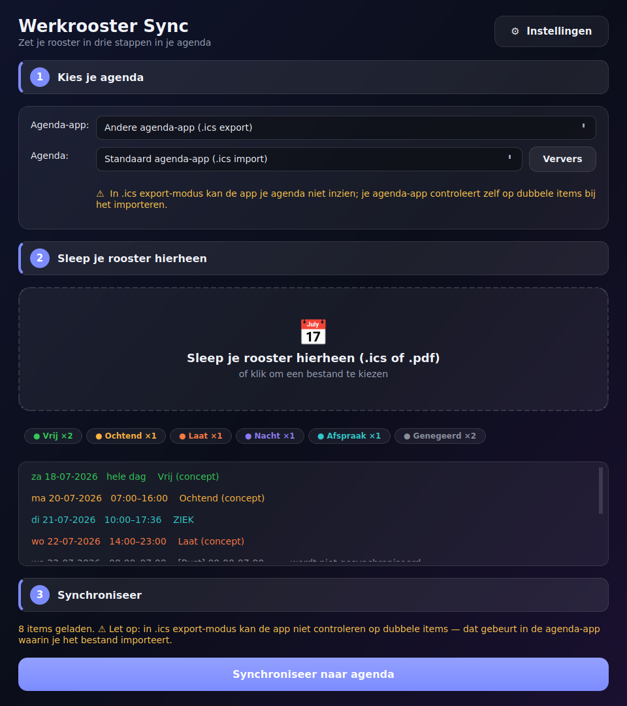
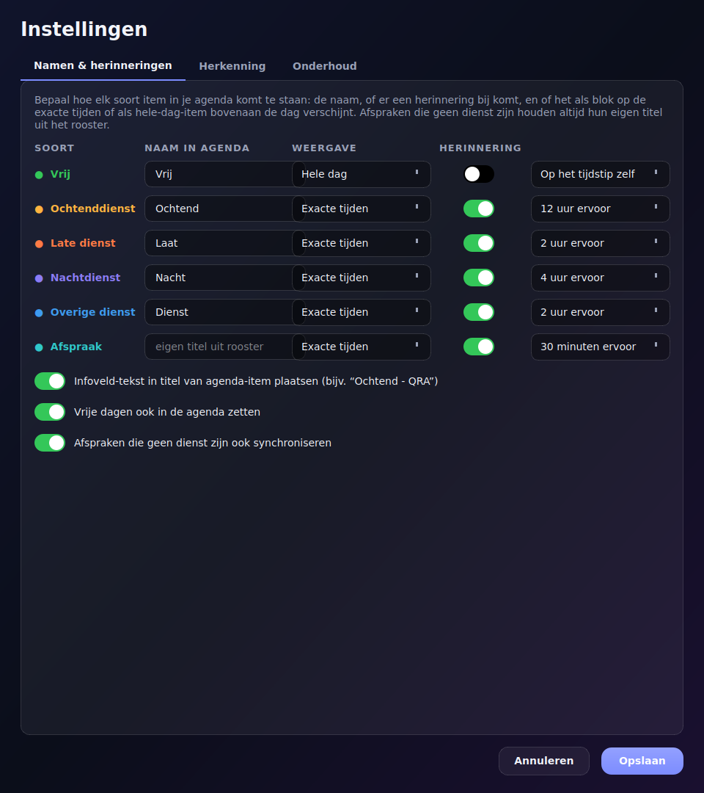

# Werkrooster Sync

Zet je werkrooster (.ics- óf PDF-bestand) in één klik in je agenda — op **macOS** én **Windows**.

De app herkent automatisch wat voor dienst elk roosteritem is en zet het met een
duidelijke naam in je agenda: **Vrij**, **Ochtend**, **Laat**, **Nacht** of **Dienst**.
Alles draait volledig lokaal; er is geen internetverbinding of account nodig.

| Hoofdscherm | Instellingen |
|---|---|
|  |  |

## Functies

- **Slepen & klaar** — sleep je rooster in het venster (of klik om te bladeren),
  bekijk de herkende diensten en druk op de grote knop *Synchroniseer naar agenda*.
- **Twee bestandsformaten, één knop** — zowel de agenda-export (.ics) als het
  "Medewerker Rooster"-PDF (definitief én concept) worden herkend en identiek
  verwerkt. Lege dagen of hele-dag-[Rust] in een PDF tellen als Vrij
  (instelbaar); memo's uit de PDF komen als notitie bij het agenda-item.
- **Automatische herkenning** — diensten worden herkend op trefwoorden in de titel
  én op begintijd (standaard: ochtend 05–12 u, laat 12–20 u, nacht 20–05 u).
  Beide zijn instelbaar.
- **Losse afspraken** — roosteritems die geen hele dienst zijn (korter dan
  5 uur, instelbaar) worden als gewone afspraak gesynchroniseerd: eigen titel,
  exacte tijden, op elke willekeurige dag — ook dagen zonder dienst.
- **Eigen namen** — pas per dienstsoort de naam aan die in je agenda komt
  (bijv. "Vroege dienst 🌅" i.p.v. "Ochtend").
- **Weergave per soort** — kies per dienstsoort of het item als blok op de
  exacte tijden of als hele-dag-item bovenaan de dag verschijnt.
- **Herinneringen** — per dienstsoort instelbaar (bijv. nachtdienst 4 uur van
  tevoren, ochtenddienst de avond ervoor), of uit.
- **Vrije dagen en afspraken optioneel** — kies zelf of "Vrij" en losse
  afspraken in je agenda komen.
- **Conceptdiensten vervangen zichzelf** — diensten uit een conceptrooster
  ([C1]/[C2]) worden gemarkeerd met "(concept)". Zodra je het definitieve (of
  een nieuwer concept-) rooster importeert, worden de verouderde conceptitems
  van die dagen automatisch vervangen — je eigen afspraken en definitieve
  diensten blijven altijd staan.
- **Geen dubbele items, gegarandeerd** — elk item dat de app aanmaakt krijgt een
  onzichtbare code (`[WerkroosterSync:…]`) in de notities. Bij het laden van een
  rooster controleert de app automatisch je agenda: wat er al staat wordt rood
  gemarkeerd ("staat al in je agenda") en bij synchroniseren overgeslagen — ook
  als je de titel van het item zelf hebt aangepast, dus je eigen aantekeningen
  blijven staan. Handmatig controleren en opruimen kan óók, via
  *Instellingen → Onderhoud*.
- **Portable** — instellingen worden opgeslagen in een `settings.json` naast de
  app; kopieer de app (mét dat bestand) naar een andere computer en alles werkt
  direct hetzelfde.

## Welke agenda-apps?

| Platform | Koppeling | Werkt met |
|---|---|---|
| macOS | Apple **Agenda** (automatisch aangestuurd) | iCloud, Google, Exchange, CalDAV — elk account dat in Agenda staat |
| Windows | Microsoft **Outlook** (automatisch aangestuurd) | Exchange / Microsoft 365 / Outlook.com — elk account dat in Outlook staat |
| Overal | **.ics-export** | Elke andere agenda-app: de app zet een opgeschoond .ics-bestand klaar en opent het in je standaard agenda-app (Google Agenda, Thunderbird, Windows Agenda, …) |

Je kiest de koppeling en de doelagenda in *Instellingen → Agenda*.

> **Eerste keer op een Mac:** macOS vraagt eenmalig om toestemming om Agenda aan
> te sturen. Klik op *Sta toe*. Later aan te passen via *Systeeminstellingen →
> Privacy en beveiliging → Automatisering*.

## Downloaden / bouwen

Elke push naar `main` bouwt automatisch beide apps via GitHub Actions
(*Actions → Test & build apps → Artifacts*):

- `WerkroosterSync-macOS.zip` — uitpakken → **Werkrooster Sync.app**, kopieer waar je wilt.
- `WerkroosterSync-Windows` — **WerkroosterSync.exe**, één portable bestand, geen installatie.

Zelf bouwen kan ook:

```bash
# macOS (op een Mac)
./packaging/build_mac.sh          # → dist/Werkrooster Sync.app

# Windows (op een Windows-pc)
packaging\build_win.bat           # → dist\WerkroosterSync.exe
```

## Ontwikkelen

```bash
pip install -r requirements-dev.txt
python run_app.py                 # start de app
pytest tests/                     # draai de tests
```

De code is één gedeelde Python/Qt-codebase:

```
werkrooster_sync/
├── core/        rooster inlezen (ics_parser), dienst herkennen (classifier),
│                instellingen (settings), synchroniseren + ontdubbelen (sync)
├── calendars/   agenda-koppelingen: Apple Agenda (AppleScript), Outlook (COM),
│                universele .ics-export
└── ui/          PySide6-interface: hoofdvenster, drag-&-drop, instellingen
```

Nieuwe agenda-koppelingen toevoegen = één subclass van
`calendars/base.py::CalendarBackend` implementeren en registreren in
`calendars/registry.py`.
